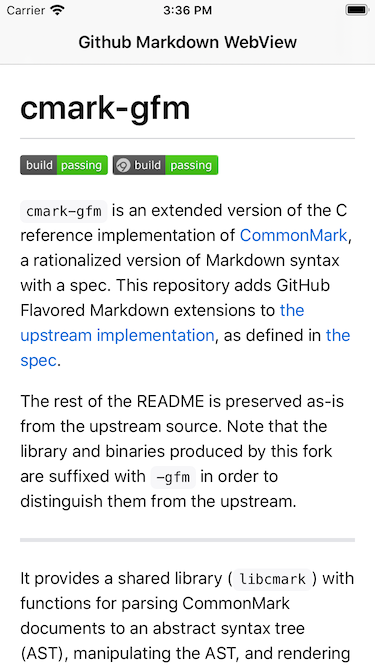

# GitHubMarkdownView

`GitHubMarkdownResources.bundle` is a part of [GitHub.app](https://apps.apple.com/us/app/github/id1477376905) for render `README.md`.

`GitHubMarkdownView` let you render markdown document with a very easy way.

- Dark & Light theme support
- Render markdown with [cmark-gfm](https://github.com/github/cmark-gfm)
- Autolayout support

## How to use

```swift
lazy var markdownWebView = GitHubMarkdownView(frame: contentView.bounds)
```

handle link actived by user

```swift
markdownWebView.linkActivedHandler = { [weak self] (url) in
                NSLog("link actived: \(url)")

                let vc = SFSafariViewController(url: url)
                self?.present(vc, animated: true, completion: nil)
            }
```

handle height of content changed

```swift
markdownWebView.heightChangedHandler = { [weak self] (height) in
            NSLog("height changed: %lf", height)
            
            if #available(iOS 11.0, *) {
                self?.tableView?.performBatchUpdates({
                })
            } else {
                self?.tableView?.beginUpdates()
                self?.tableView?.endUpdates()
            }
        }
```

load markdown from a url

```swift
let url = URL(string: "https://raw.githubusercontent.com/github/cmark-gfm/master/README.md")

markdownWebView.load({ [weak self] (completion) in
                guard let isLoaded = self?.isLoaded, !isLoaded else {
                    return
                }

                self?.isLoaded = true
                self?.loadURL(url, completion: completion)

                }, baseURL: url?.deletingLastPathComponent())

func loadURL(_ url: URL?, completion: ((String?) -> Void)?) {
        let task = URLSession.shared.dataTask(with: url!) { (data, resp, error) in
            DispatchQueue.main.async {
                if let data = data, let markdown = String(data: data, encoding: .utf8) {
                    completion?(markdown)
                }
            }
        }
        task.resume()
    }
```

## Screenshot

Light mode



Dark mode

